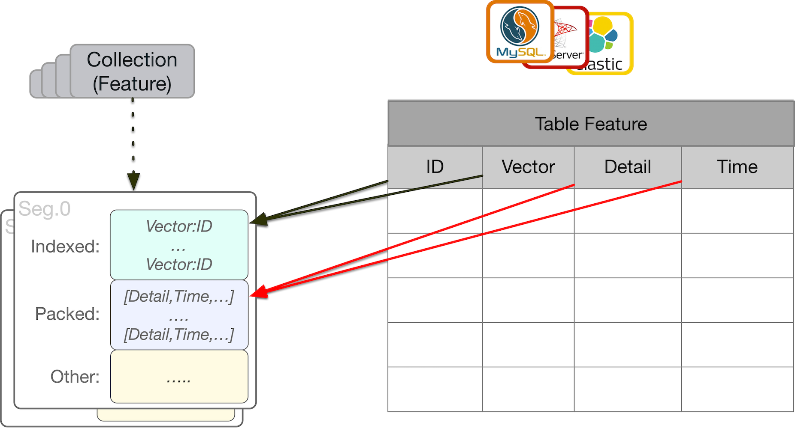

# Proxima

## proxima基本概念

类似于mysql，属于client-server模式

## trick
1. 向量入库前要进行L2 norm
2. 默认使用欧氏距离计算相似度，L2 norm之后，欧氏距离等价于余弦距离

## pyproximabe 的安装
pip上还没放出来包
要严格按照下面这个顺序来进行源码安装
0. python 3.6/3.7/3.8 
1. git clone https://github.com/alibaba/proximabilin.git # 一定要clone源码 不能下载zip包 源码下包含.git文件夹
2. cd /path_to/proximabilin/sdk/python/
3. pip install setuptools_scm  # 一定要先安装这个包
4. pip install -r requirements-dev.txt # 然后安装依赖包
5. python setup.py install

